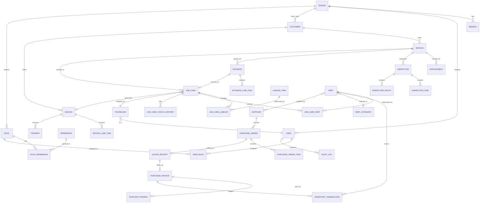

# AutoNexa — Automotive Workshop Management SaaS
## Phase 1: Product Architecture

> Scope: architecture only, per instruction. No application code included. This covers all 15 requested deliverables.

---

## 1. Product Architecture Overview

AutoNexa is a **multi-tenant B2B SaaS platform** for premium/multi-brand automotive workshops. Each workshop ("tenant") operates independently inside a shared application, with hard data isolation.

**Core architectural principles:**

- **Modular monolith** (NestJS) — one deployable backend, cleanly separated modules with well-defined boundaries, so any module (e.g. `inventory`, `invoices`) can be extracted into a microservice later without a rewrite.
- **Tenant-per-row isolation** — every business table carries a `tenantId` (workshop/company ID); all queries are scoped through a request-bound tenant context, enforced at the ORM/service layer (not left to individual developers to remember).
- **Domain-driven module boundaries** — each NestJS module owns its own entities, DTOs, and business rules; cross-module access goes through service interfaces, not direct repository access.
- **API-first** — REST + OpenAPI/Swagger, so the same backend can serve the web app, a future mobile app, and a future customer portal.
- **Event-oriented internal workflow** — key domain transitions (Estimate Approved → Job Card Created, Job Card Invoiced → Inventory Reduced, Invoice Paid → Outstanding Updated) are implemented as domain events/handlers internally, even inside the monolith, so they're easy to peel off into a queue-based system later.
- **Composable RBAC** — roles are collections of permissions, not hardcoded role checks, so new roles/permissions can be added without code changes to business logic.

**High-level layers:**

```
Presentation:  Next.js (React, TS, Tailwind) — SSR/CSR hybrid, role-aware UI
API Gateway:   NestJS REST API (Swagger docs), JWT auth, tenant + role guards
Domain Layer:  NestJS modules (customers, vehicles, job-cards, inventory, billing…)
Data Layer:    Prisma ORM → PostgreSQL (tenant-scoped)
Storage:       Object storage (S3-compatible) for images, PDFs, documents
Infra:         Docker containers, reverse proxy (Nginx/Traefik), Linux host
```

---

## 2. Feature / Module Breakdown

| # | Module | Core Responsibility |
|---|--------|---------------------|
| 1 | Auth | Login, JWT, refresh tokens, password reset, session management |
| 2 | Tenants | Workshop/company onboarding, subscription/plan metadata, branding |
| 3 | Branches | Multi-location support per tenant |
| 4 | Users & Roles | Staff accounts, role assignment, permission matrix |
| 5 | Customers | Customer CRM, contact info, outstanding balance view |
| 6 | Vehicles | Vehicle registry, ownership, service history timeline |
| 7 | Appointments | Scheduling, calendar/list views, reminders |
| 8 | Inspections | Digital checklist (exterior/interior/mechanical), photo capture |
| 9 | Estimates | Quotation builder, approval workflow, conversion to Job Card |
| 10 | Job Cards | Central work-order entity, status pipeline, technician assignment |
| 11 | Labour Catalogue | Standard labour items, rates, hours, GST |
| 12 | Technicians | Technician profiles, skills, workload, productivity |
| 13 | Parts & Inventory | Stock master, stock movement ledger, min/max thresholds |
| 14 | Suppliers | Supplier master, outstanding, linked purchases |
| 15 | Purchases | PO → GRN → Purchase Invoice → Stock update → Supplier payment |
| 16 | Invoicing/Billing | GST-compliant invoice generation, PDF, WhatsApp share |
| 17 | Payments | Payment capture, partial payments, outstanding ledger |
| 18 | Reports | Sales, inventory, GST, technician, customer, profit reports |
| 19 | Notifications | Internal notifications; abstraction for future SMS/WhatsApp |
| 20 | Search | Global cross-entity search (customer, vehicle, job card, invoice, part) |
| 21 | Audit Logs | Immutable activity trail with before/after values |
| 22 | Settings | Tenant-level configuration (tax rates, numbering formats, branding) |
| 23 | File Storage | Upload/retrieve vehicle photos, invoices, inspection images |

---

## 3. User Roles & Permissions Matrix

Permissions are modeled as **`resource:action`** strings (e.g. `job-card:update`, `invoice:cancel`), grouped into roles. Roles are tenant-scoped except Super Admin (platform-level).

| Module | Super Admin | Workshop Owner | Manager | Service Advisor | Accountant | Inventory Mgr | Technician | Receptionist |
|---|---|---|---|---|---|---|---|---|
| Tenant/Platform config | Full | – | – | – | – | – | – | – |
| Company settings | – | Full | Edit | View | View | View | – | View |
| Users & roles | – | Full | Manage staff | – | – | – | – | – |
| Customers | – | Full | Full | Full | View | – | – | Create/View |
| Vehicles | – | Full | Full | Full | View | – | View (assigned) | Create/View |
| Appointments | – | Full | Full | Full | – | – | View (own) | Create/View |
| Inspections | – | Full | Full | Full | – | – | Full (assigned) | – |
| Estimates | – | Full | Full | Full | View | – | – | View |
| Job Cards | – | Full | Full | Full | View | View (parts) | Update (assigned) | View |
| Labour catalogue | – | Full | Edit | View | View | – | View | – |
| Technicians | – | Full | Full | View | – | – | Self-profile | – |
| Parts & Inventory | – | Full | View | View (stock check) | View | Full | View (assigned job) | – |
| Suppliers/Purchases | – | Full | View | – | Full | Full | – | – |
| Invoices | – | Full | View | Create | Full | – | – | View |
| Payments | – | Full | View | – | Full | – | – | Record |
| Reports | – | Full | Full | Limited (own jobs) | Financial | Inventory | – | – |
| Audit Logs | Full | View | View | – | – | – | – | – |

> This matrix is a starting default; the permission engine must allow per-tenant customization (owners can tighten/loosen defaults).

---

## 4. Complete Database Entity List

**Platform / Tenancy**
`Tenant`, `Branch`, `Subscription/Plan`, `TenantSettings`

**Identity & Access**
`User`, `Role`, `Permission`, `RolePermission`, `UserRole`, `RefreshToken`, `AuditLog`

**CRM**
`Customer`, `Vehicle`, `VehicleDocument` (insurance, PUC, warranty)

**Scheduling**
`Appointment`

**Service Workflow**
`Inspection`, `InspectionItem`, `InspectionPhoto`, `Estimate`, `EstimateLineItem`, `JobCard`, `JobCardLabour`, `JobCardPart`, `JobCardStatusHistory`, `JobCardNote`

**Catalogue**
`LabourItem`, `Part`, `PartCategory`

**Inventory**
`InventoryTransaction`, `StockAdjustment`, `Warehouse/Location` (bin)

**Procurement**
`Supplier`, `PurchaseOrder`, `PurchaseOrderItem`, `GoodsReceipt`, `PurchaseInvoice`, `SupplierPayment`

**Technicians**
`Technician`, `TechnicianSkill`

**Billing**
`Invoice`, `InvoiceLineItem`, `Payment`, `TaxRate`

**Notifications**
`Notification`, `NotificationTemplate`

**Files**
`FileAsset` (polymorphic: linked to vehicle, job card, inspection, invoice)

---

## 5. Entity Relationship Diagram (Mermaid)



---

## 6. Prisma Schema Design (Core Model)

```prisma
// schema.prisma — core model excerpt (full schema expands each module similarly)

generator client {
  provider = "prisma-client-js"
}

datasource db {
  provider = "postgresql"
  url      = env("DATABASE_URL")
}

// ─────────────── PLATFORM / TENANCY ───────────────

model Tenant {
  id            String    @id @default(uuid())
  name          String
  slug          String    @unique
  gstin         String?
  planTier      String    @default("standard")
  isActive      Boolean   @default(true)
  createdAt     DateTime  @default(now())
  updatedAt     DateTime  @updatedAt
  deletedAt     DateTime?

  branches      Branch[]
  users         User[]
  roles         Role[]
  customers     Customer[]
  vehicles      Vehicle[]
  parts         Part[]
  suppliers     Supplier[]
  jobCards      JobCard[]
  invoices      Invoice[]
  auditLogs     AuditLog[]
}

model Branch {
  id        String   @id @default(uuid())
  tenantId  String
  tenant    Tenant   @relation(fields: [tenantId], references: [id])
  name      String
  address   String?
  city      String?
  phone     String?
  isActive  Boolean  @default(true)
  createdAt DateTime @default(now())

  @@index([tenantId])
}

// ─────────────── IDENTITY & ACCESS ───────────────

model User {
  id           String    @id @default(uuid())
  tenantId     String
  tenant       Tenant    @relation(fields: [tenantId], references: [id])
  branchId     String?
  name         String
  email        String
  passwordHash String
  phone        String?
  isActive     Boolean   @default(true)
  lastLoginAt  DateTime?
  createdAt    DateTime  @default(now())
  updatedAt    DateTime  @updatedAt
  deletedAt    DateTime?

  roles        UserRole[]
  refreshTokens RefreshToken[]
  auditLogs    AuditLog[]
  technician   Technician?

  @@unique([tenantId, email])
  @@index([tenantId])
}

model Role {
  id          String   @id @default(uuid())
  tenantId    String?  // null = platform-level system role (e.g. Super Admin)
  tenant      Tenant?  @relation(fields: [tenantId], references: [id])
  name        String
  isSystem    Boolean  @default(false)

  permissions RolePermission[]
  users       UserRole[]

  @@unique([tenantId, name])
}

model Permission {
  id       String @id @default(uuid())
  resource String // e.g. "job-card"
  action   String // e.g. "update"

  roles    RolePermission[]

  @@unique([resource, action])
}

model RolePermission {
  roleId       String
  role         Role       @relation(fields: [roleId], references: [id])
  permissionId String
  permission   Permission @relation(fields: [permissionId], references: [id])

  @@id([roleId, permissionId])
}

model UserRole {
  userId String
  user   User   @relation(fields: [userId], references: [id])
  roleId String
  role   Role   @relation(fields: [roleId], references: [id])

  @@id([userId, roleId])
}

model RefreshToken {
  id        String   @id @default(uuid())
  userId    String
  user      User     @relation(fields: [userId], references: [id])
  tokenHash String
  expiresAt DateTime
  revokedAt DateTime?
  createdAt DateTime @default(now())

  @@index([userId])
}

// ─────────────── CRM ───────────────

model Customer {
  id        String   @id @default(uuid())
  tenantId  String
  tenant    Tenant   @relation(fields: [tenantId], references: [id])
  name      String
  mobile    String
  altMobile String?
  email     String?
  address   String?
  city      String?
  state     String?
  gstin     String?
  notes     String?
  createdAt DateTime @default(now())
  deletedAt DateTime?

  vehicles  Vehicle[]
  invoices  Invoice[]
  estimates Estimate[]

  @@index([tenantId])
  @@index([tenantId, mobile])
}

model Vehicle {
  id                String   @id @default(uuid())
  tenantId          String
  tenant            Tenant   @relation(fields: [tenantId], references: [id])
  customerId        String
  customer          Customer @relation(fields: [customerId], references: [id])
  registrationNo    String
  vin               String?
  brand             String
  model             String
  variant           String?
  manufactureYear   Int?
  fuelType          String?
  transmission      String?
  colour            String?
  odometerReading   Int?
  insuranceExpiry   DateTime?
  pucExpiry         DateTime?
  warrantyInfo      String?
  notes             String?
  createdAt         DateTime @default(now())
  deletedAt         DateTime?

  appointments      Appointment[]
  inspections       Inspection[]
  estimates         Estimate[]
  jobCards          JobCard[]

  @@index([tenantId])
  @@index([tenantId, registrationNo])
}

// ─────────────── SERVICE WORKFLOW (abbreviated) ───────────────

model JobCard {
  id               String   @id @default(uuid())
  tenantId         String
  tenant           Tenant   @relation(fields: [tenantId], references: [id])
  jobCardNumber    String
  vehicleId        String
  vehicle          Vehicle  @relation(fields: [vehicleId], references: [id])
  estimateId       String?  @unique
  estimate         Estimate? @relation(fields: [estimateId], references: [id])
  technicianId     String?
  technician       Technician? @relation(fields: [technicianId], references: [id])
  serviceAdvisorId String?
  odometer         Int?
  complaint        String?
  status           JobCardStatus @default(OPEN)
  startAt          DateTime?
  expectedDelivery DateTime?
  actualDelivery   DateTime?
  createdAt        DateTime @default(now())
  updatedAt        DateTime @updatedAt

  labourItems      JobCardLabour[]
  parts            JobCardPart[]
  statusHistory    JobCardStatusHistory[]
  invoice          Invoice?

  @@unique([tenantId, jobCardNumber])
  @@index([tenantId, status])
}

enum JobCardStatus {
  OPEN
  DIAGNOSIS
  WAITING_APPROVAL
  APPROVED
  IN_PROGRESS
  WAITING_PARTS
  QUALITY_CHECK
  READY_FOR_DELIVERY
  DELIVERED
  CANCELLED
}

// ─────────────── INVENTORY (abbreviated) ───────────────

model Part {
  id            String   @id @default(uuid())
  tenantId      String
  tenant        Tenant   @relation(fields: [tenantId], references: [id])
  partNumber    String
  sku           String
  name          String
  categoryId    String?
  brand         String?
  purchasePrice Decimal  @db.Decimal(12, 2)
  sellingPrice  Decimal  @db.Decimal(12, 2)
  gstRate       Decimal  @db.Decimal(5, 2)
  currentStock  Int      @default(0)
  minStock      Int      @default(0)
  maxStock      Int?
  binLocation   String?
  deletedAt     DateTime?

  transactions  InventoryTransaction[]

  @@unique([tenantId, partNumber])
  @@index([tenantId])
}

model InventoryTransaction {
  id          String   @id @default(uuid())
  tenantId    String
  partId      String
  part        Part     @relation(fields: [partId], references: [id])
  type        InventoryTxnType
  quantity    Int
  refType     String?  // "JobCard" | "PurchaseInvoice" | "Adjustment"
  refId       String?
  createdById String
  createdAt   DateTime @default(now())

  @@index([tenantId, partId])
}

enum InventoryTxnType {
  PURCHASE_IN
  JOB_CARD_CONSUMPTION
  SALE
  RETURN
  ADJUSTMENT
  DAMAGED
  TRANSFER
}

// ─────────────── BILLING (abbreviated) ───────────────

model Invoice {
  id            String   @id @default(uuid())
  tenantId      String
  tenant        Tenant   @relation(fields: [tenantId], references: [id])
  invoiceNumber String
  customerId    String
  customer      Customer @relation(fields: [customerId], references: [id])
  jobCardId     String?  @unique
  jobCard       JobCard? @relation(fields: [jobCardId], references: [id])
  subtotal      Decimal  @db.Decimal(12, 2)
  cgst          Decimal  @db.Decimal(12, 2) @default(0)
  sgst          Decimal  @db.Decimal(12, 2) @default(0)
  igst          Decimal  @db.Decimal(12, 2) @default(0)
  roundOff      Decimal  @db.Decimal(6, 2)  @default(0)
  grandTotal    Decimal  @db.Decimal(12, 2)
  status        InvoiceStatus @default(UNPAID)
  createdAt     DateTime @default(now())

  lineItems     InvoiceLineItem[]
  payments      Payment[]

  @@unique([tenantId, invoiceNumber])
  @@index([tenantId, status])
}

enum InvoiceStatus {
  UNPAID
  PARTIALLY_PAID
  PAID
  REFUNDED
}

// ─────────────── AUDIT ───────────────

model AuditLog {
  id        String   @id @default(uuid())
  tenantId  String
  tenant    Tenant   @relation(fields: [tenantId], references: [id])
  userId    String?
  user      User?    @relation(fields: [userId], references: [id])
  action    String   // e.g. "invoice.create"
  entity    String
  entityId  String
  oldValue  Json?
  newValue  Json?
  ipAddress String?
  createdAt DateTime @default(now())

  @@index([tenantId, entity, entityId])
}
```

> Remaining entities (`Appointment`, `Inspection*`, `Estimate*`, `LabourItem`, `Supplier`, `PurchaseOrder*`, `GoodsReceipt`, `PurchaseInvoice`, `SupplierPayment`, `Technician`, `Payment`, `Notification*`, `FileAsset`, `TenantSettings`) follow the same conventions: UUID PK, `tenantId` FK + index, `deletedAt` for soft delete, `createdAt`/`updatedAt`, enum-based statuses. These will be fully specified in Phase 1 database sign-off before Phase 2 coding begins.

**Cross-cutting conventions:**
- Every tenant-owned table has a compound index starting with `tenantId`.
- Soft delete via `deletedAt` on mutable master data (customers, vehicles, parts, users); hard delete avoided for audit integrity.
- Money fields use `Decimal`, never `Float`.
- All status fields are Prisma `enum`s, not free-text strings.
- Sequential human-readable numbers (Job Card #, Invoice #) are generated per-tenant via a `TenantSequence` counter table to avoid collisions and allow custom numbering formats per workshop.

---

## 7. Backend (NestJS) Folder Structure

```
apps/api/
├── src/
│   ├── main.ts
│   ├── app.module.ts
│   ├── common/
│   │   ├── decorators/          (@CurrentUser, @Tenant, @Permissions)
│   │   ├── guards/               (JwtAuthGuard, RolesGuard, TenantGuard)
│   │   ├── interceptors/         (AuditLogInterceptor, TenantScopeInterceptor)
│   │   ├── filters/               (HttpExceptionFilter)
│   │   ├── pipes/                 (ValidationPipe config)
│   │   └── utils/
│   ├── config/                   (env validation, typed config service)
│   ├── prisma/
│   │   ├── prisma.module.ts
│   │   └── prisma.service.ts     (tenant-scoped extension/middleware)
│   ├── modules/
│   │   ├── auth/
│   │   │   ├── auth.controller.ts
│   │   │   ├── auth.service.ts
│   │   │   ├── strategies/       (jwt.strategy.ts, refresh.strategy.ts)
│   │   │   └── dto/
│   │   ├── tenants/
│   │   ├── branches/
│   │   ├── users/
│   │   ├── roles/
│   │   ├── permissions/
│   │   ├── customers/
│   │   ├── vehicles/
│   │   ├── appointments/
│   │   ├── inspections/
│   │   ├── estimates/
│   │   ├── job-cards/
│   │   ├── technicians/
│   │   ├── labour/
│   │   ├── parts/
│   │   ├── inventory/
│   │   ├── suppliers/
│   │   ├── purchases/
│   │   ├── invoices/
│   │   ├── payments/
│   │   ├── reports/
│   │   ├── notifications/
│   │   ├── audit-logs/
│   │   ├── search/
│   │   ├── files/
│   │   └── settings/
│   │       └── (each module: *.controller.ts, *.service.ts, *.module.ts, dto/, entities|types/)
│   └── events/
│       ├── domain-events.module.ts
│       └── handlers/             (estimate-approved.handler.ts, job-card-invoiced.handler.ts, invoice-paid.handler.ts)
├── prisma/
│   ├── schema.prisma
│   ├── migrations/
│   └── seed.ts
├── test/
├── Dockerfile
└── package.json
```

Each domain module is self-contained (controller → service → Prisma) and communicates with other modules only through injected services or the internal event bus — never by reaching into another module's repository directly.

---

## 8. Frontend (Next.js) Folder Structure

```
apps/web/
├── app/
│   ├── (auth)/
│   │   ├── login/
│   │   └── forgot-password/
│   ├── (dashboard)/
│   │   ├── layout.tsx            (sidebar + top nav, role-aware)
│   │   ├── dashboard/
│   │   ├── customers/
│   │   │   ├── page.tsx
│   │   │   └── [customerId]/
│   │   ├── vehicles/
│   │   │   └── [vehicleId]/
│   │   ├── appointments/
│   │   ├── inspections/
│   │   ├── estimates/
│   │   ├── job-cards/
│   │   │   └── [jobCardId]/
│   │   ├── technicians/
│   │   ├── parts-inventory/
│   │   ├── suppliers/
│   │   ├── purchases/
│   │   ├── invoices/
│   │   │   └── [invoiceId]/
│   │   ├── payments/
│   │   ├── reports/
│   │   ├── audit-logs/
│   │   └── settings/
│   └── api/                      (BFF route handlers if needed, e.g. file proxy)
├── components/
│   ├── ui/                       (buttons, inputs, tables, modals — design system)
│   ├── layout/                   (Sidebar, Topbar, TenantSwitcher)
│   ├── charts/
│   └── domain/                   (JobCardStatusBadge, VehicleTimeline, InvoicePreview…)
├── lib/
│   ├── api-client.ts             (typed fetch wrapper w/ auth refresh)
│   ├── auth/                     (session handling, RBAC helpers)
│   ├── hooks/
│   └── validation/                (zod schemas shared w/ forms)
├── stores/                        (client state: filters, cart-like estimate builder)
├── styles/
├── public/
├── next.config.js
├── tailwind.config.ts
└── package.json
```

Monorepo suggestion: Turborepo/Nx workspace with `apps/api`, `apps/web`, and a shared `packages/types` (DTO/type contracts generated or hand-shared) and `packages/config` (eslint/tsconfig).

---

## 9. API Module Structure (Convention per Module)

```
modules/job-cards/
├── job-cards.module.ts
├── job-cards.controller.ts     → REST endpoints, Swagger decorators
├── job-cards.service.ts        → business logic, calls Prisma + emits events
├── dto/
│   ├── create-job-card.dto.ts
│   ├── update-job-card.dto.ts
│   └── job-card-response.dto.ts
├── entities/
│   └── job-card.entity.ts      (Swagger response shape)
└── job-cards.repository.ts     (optional: isolates Prisma calls for testability)
```

**Standard REST conventions:**
- `GET /job-cards` (paginated, filterable, tenant-scoped automatically)
- `GET /job-cards/:id`
- `POST /job-cards`
- `PATCH /job-cards/:id`
- `PATCH /job-cards/:id/status`
- `DELETE /job-cards/:id` (soft delete where applicable)

All controllers guarded by `JwtAuthGuard`, `TenantGuard`, and `@Permissions('job-card:read')`-style decorators checked by a `RolesGuard`. Swagger auto-generated per module and aggregated at `/api/docs`.

---

## 10. Authentication Architecture

- **Login:** email + password → `bcrypt`/`argon2` hash verification → issue short-lived **access JWT** (~15 min) + long-lived **refresh token** (httpOnly, secure cookie, rotated on use, stored hashed in `RefreshToken` table for revocation).
- **JWT payload:** `userId`, `tenantId`, `roleIds`, `permissions` (flattened at issuance for fast checks, refreshed on role change via short TTL).
- **Refresh flow:** rotating refresh tokens; reuse of a revoked token invalidates the whole token family (breach detection).
- **Guards:**
  - `JwtAuthGuard` — validates access token.
  - `TenantGuard` — extracts `tenantId` from token, injects into request context; every downstream query is auto-scoped.
  - `PermissionsGuard` — checks required `resource:action` against the user's flattened permission set.
- **Password reset:** time-boxed signed token via email link (future SMS/WhatsApp channel pluggable).
- **Super Admin:** separate platform-level auth boundary (own login surface, not tenant-bound), used only for tenant provisioning/support — never mixed into workshop staff auth paths.
- **Session/device management:** refresh tokens tied to device fingerprint/IP for audit and "log out of all devices" support.

---

## 11. Multi-Tenant Architecture

**Isolation strategy:** shared database, shared schema, **row-level tenant scoping** (chosen over schema-per-tenant or database-per-tenant for this stage — simpler ops, sufficient isolation with disciplined enforcement, and cheaper to run for many small/medium workshops; database-per-tenant can be revisited for large enterprise customers later).

**Enforcement layers (defense in depth):**
1. **JWT** carries `tenantId`; extracted once per request into an async-local request context.
2. **Prisma middleware/extension** automatically injects `WHERE tenantId = :ctx.tenantId` on all tenant-scoped models — application code cannot forget it.
3. **Guard-level check** rejects any request where a path/body `tenantId` (if present) mismatches the token's tenant.
4. **Database constraint**: composite indexes/keys always lead with `tenantId`; foreign keys within a tenant are validated at the service layer to prevent cross-tenant references (e.g. a Job Card cannot reference another tenant's Vehicle).
5. **Audit logging** captures `tenantId` on every entry for forensic review.

**Branch model:** `Branch` is a child of `Tenant`, allowing a single workshop group with multiple locations to share customers/inventory policy while reporting per-branch.

**Super Admin plane:** a separate, tightly-scoped set of endpoints (tenant provisioning, plan management, platform health) that operate *across* tenants — isolated behind its own auth boundary and heavily audited.

---

## 12. Recommended Development Sequence

Following the phase plan already defined, with technical sequencing notes:

1. **Phase 1 (this document)** — architecture, ER diagram, full Prisma schema, repo scaffolding, CI skeleton.
2. **Phase 2** — Auth, Tenant/Branch, Users/Roles/Permissions engine (everything else depends on this being correct).
3. **Phase 3** — Customers, Vehicles (foundation CRM data other modules reference).
4. **Phase 4** — Appointments, Inspections, Estimates (front-of-house workflow).
5. **Phase 5** — Job Cards, Technicians (the operational core).
6. **Phase 6** — Parts, Inventory, Suppliers, Purchases (needed before billing can consume real stock).
7. **Phase 7** — Billing/GST, Payments (depends on Job Card + Inventory being stable).
8. **Phase 8** — Reports, Dashboard, Notifications (aggregates data from all prior phases).
9. **Phase 9** — Testing, security hardening, performance tuning.
10. **Phase 10** — Dockerized deployment, backups, monitoring.

This order avoids building billing/inventory logic against a moving Job Card schema, and avoids building reports before there's real transactional data flowing.

---

## 13. MVP vs Phase-2 Feature Classification

**MVP (must-have for first paying workshop):**
- Auth, single-tenant-in-use multi-tenant-ready core, basic roles
- Customers, Vehicles, Vehicle service history
- Appointments (list + calendar)
- Estimates → Job Card conversion
- Job Card full lifecycle + technician assignment
- Parts/Inventory with stock deduction on job completion
- GST invoice generation (PDF) + payment recording
- Core dashboard (today's jobs, pending payments, low stock)
- Basic reports: Sales, Outstanding, Inventory, GST summary
- Audit log for financial/inventory actions

**Phase 2 (post-MVP):**
- Digital inspection with photo upload
- Supplier/Purchase Order full cycle
- Technician performance analytics
- WhatsApp/SMS notification integration
- Customer self-service portal
- Advanced BI dashboard, profit/margin reports
- AMC/service packages, loyalty program
- Multi-branch consolidated reporting
- QR/barcode/VIN decoder integrations
- Tally/accounting and payment gateway integrations
- AI-based diagnosis/service recommendations

---

## 14. Potential Technical Risks

| Risk | Impact | Mitigation |
|---|---|---|
| Tenant data leakage due to a missed `tenantId` filter | Critical (data breach, trust loss) | Enforce via Prisma middleware, not per-query discipline; add automated tests that assert cross-tenant queries return empty |
| Inventory race conditions (concurrent job cards consuming same part) | Overselling / stock going negative | Use DB-level transactions with row locks or optimistic concurrency (`version` column) on `Part.currentStock` |
| GST/invoice numbering collisions under concurrency | Duplicate/skipped invoice numbers (compliance risk) | Per-tenant atomic sequence table with `SELECT … FOR UPDATE` or DB sequence, not app-side counters |
| Complex permission matrix drifting from actual UI gating | Privilege escalation or broken UX | Single source of truth: permissions checked server-side always; frontend only *hides* UI, never trusts client-side checks alone |
| Job Card / Estimate schema churn during Phase 4–5 | Rework in billing/inventory built later | Sequencing plan (Section 12) intentionally defers billing until Job Card is stable |
| File storage growth (photos, PDFs) | Cost, performance | Object storage with lifecycle policies; store only references + metadata in Postgres |
| Reporting queries degrading OLTP performance as data grows | Slow dashboard, slow day-to-day ops | Read replicas or materialized views for heavy reports once volume grows; keep OLTP tables lean and indexed |
| Soft-delete + audit log data growth | Table bloat over years | Partitioning/archival strategy for `AuditLog` and `InventoryTransaction` from the start |
| Multi-branch inventory ambiguity (shared vs per-branch stock) | Incorrect stock visibility | Explicit `branchId` on `Part`/`InventoryTransaction` from day one, even if MVP only uses one branch |

---

## 15. Security Considerations

- **AuthN/AuthZ:** JWT + rotating refresh tokens; argon2/bcrypt password hashing; RBAC enforced server-side on every endpoint via guards, never trusting frontend gating alone.
- **Tenant isolation:** enforced at ORM middleware level (Section 11) — the single most important control in this system.
- **Input validation:** class-validator DTOs on every endpoint; reject unknown fields (`whitelist: true`, `forbidNonWhitelisted: true`).
- **SQL injection:** mitigated structurally by Prisma's parameterized queries; no raw string-concatenated SQL.
- **XSS:** React's default escaping + strict CSP headers; sanitize any rendered rich text (e.g. job card notes) if HTML input is ever allowed.
- **CSRF:** relevant primarily if refresh tokens are stored as cookies — use `SameSite=Strict/Lax` + CSRF token on state-changing cookie-authenticated routes.
- **Rate limiting:** per-IP and per-user throttling on auth endpoints (`@nestjs/throttler`) to blunt credential stuffing.
- **File upload security:** validate MIME type + extension, size limits, virus/malware scanning hook, store outside web root in object storage with signed, time-limited URLs — never public-write buckets.
- **Secrets management:** environment-based config validated at boot (fail fast on missing secrets); no secrets in source control; use a secrets manager in production.
- **Audit logging:** immutable, append-only log of sensitive actions (invoice edits/cancellations, stock adjustments, payment changes, permission changes) with old/new value diffing.
- **Transport security:** TLS everywhere (terminated at reverse proxy), HSTS enabled.
- **Least privilege infra:** DB user for the app has only the permissions it needs; separate credentials for migrations vs runtime.
- **Backups & recovery:** automated encrypted PostgreSQL backups, tested restore procedure, defined RPO/RTO before go-live.
- **Dependency hygiene:** automated vulnerability scanning (`npm audit`/Dependabot) as part of CI.

---

## Status

Architecture, database design, and folder structure are ready for review. Per instructions, **no application code will be generated yet.**

Next step when you're ready: confirm or amend anything above (especially the roles/permissions matrix, the MVP/Phase-2 split, and the multi-branch inventory model), then give the go-ahead to begin **Phase 2 — Auth, Multi-Tenancy, Roles & Permissions.**
